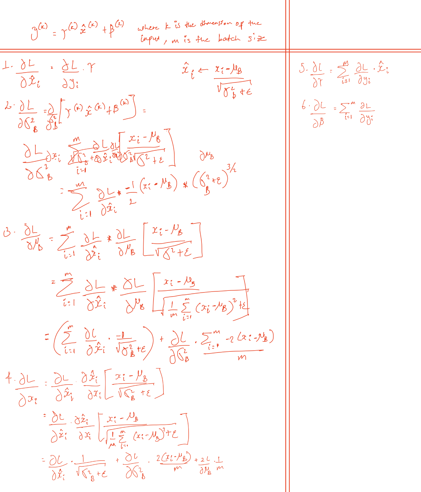

## Paper info

**Title:** [Batch Normalization: Accelerating Deep Network Training by Reducing Internal Covariate Shift](https://arxiv.org/abs/1502.03167)

**Authors:** Sergey Ioffe, Christian Szegedy

## TL;DR

Training deep neural networks requires careful configuration of parameter initialization, learning rate adjustment, and regularization. Even then, a slight shift in the distribution of network layer inputs makes training difficult. This phenomenon is called internal covariate shift. The research proposes Batch Normalization, a technique that normalizes mini-batches with learnable weights and bias to mitigate it. The method achieved state-of-the-art results on ImageNet classification.

## Context

Consider a two-layer neural network: $\ell = F_2(F_1(u, \Theta_1), \Theta_2)$. $\Theta_1$ and $\Theta_2$ are learnable parameters of the network, and $F_1$ and $F_2$ are transformations applied to learnable parameters. For illustration, we can rewrite $\ell = F_2(F_1(u, \Theta_1), \Theta_2)$ as $\ell = F_2(x, \Theta_2)$ where $x = F_1(u, \Theta_1)$.

The gradient learning step for $\Theta_2$, for instance, would look like:

$$
\Theta_2 \leftarrow \Theta_2 - \frac{\alpha}{m} \sum_{i=1}^{m} \frac{\partial F_2(x_i, \Theta_2)}{\partial \Theta_2}
$$

A slight change in the distribution of $x$ affects both training and test performance. It is desirable to keep the distribution of $x$ fixed. This problem amplifies as network depth increases—neural networks magnify or shrink small differences across a batch. This internal change in distribution is referred to as **internal covariate shift**.

Batch normalization aims to mitigate this by normalizing batches of inputs with learnable weights and bias to reduce covariate shift. They do this by preserving the statistics of the entire training data. Due to these properties, Batch normalization also enables faster, more stable training with higher learning rates and without divergence. It also functions like a regularizer.

## Main idea

Batch normalization first normalizes each scalar input feature separately with a mean of 0 and a variance of 1, computed over the training data:

$$
\hat{x}^{(k)} = \frac{x^{(k)} - E[x^{(k)}]}{\sqrt{Var[x^{(k)}]}}
$$

where $\vec{x} = (x^{(1)}, \ldots, x^{(k)}) \in \mathbb{R}^k$.

To preserve the expressive power of the layer before passing $\hat{x}$ to the activation function, learnable parameters $\gamma$ and $\beta$ are introduced; they are learned along with other model parameters:

$$
y^{(k)} = \gamma^{(k)} \hat{x}^{(k)} + \beta^{(k)}
$$

For a mini-batch $B = \{x_{1 \ldots m}\}$ where $m > 1$:

$$
\mu_B \leftarrow \frac{1}{m} \sum_{i=1}^{m} x_i \qquad \text{// mini-batch mean}
$$

$$
\sigma_B^2 \leftarrow \frac{1}{m} \sum_{i=1}^{m} (x_i - \mu_B)^2 \qquad \text{// mini-batch variance}
$$

$$
\hat{x}_i \leftarrow \frac{x_i - \mu_B}{\sqrt{\sigma_B^2 + \epsilon}} \qquad \text{// normalize}
$$

$$
y_i \leftarrow \gamma \hat{x}_i + \beta \equiv BN_{\gamma,\beta}(x_i) \qquad \text{// scale and shift}
$$

At inference time, moving averages of the mini-batch means and variances are used for normalization.

## Backpropagation

In the following section, I show the backpropagation step for batch normalization. Note that there are some notation errors in the derivations below.

## Question

What happens if we set the batch size to 1 when using batch normalization?
