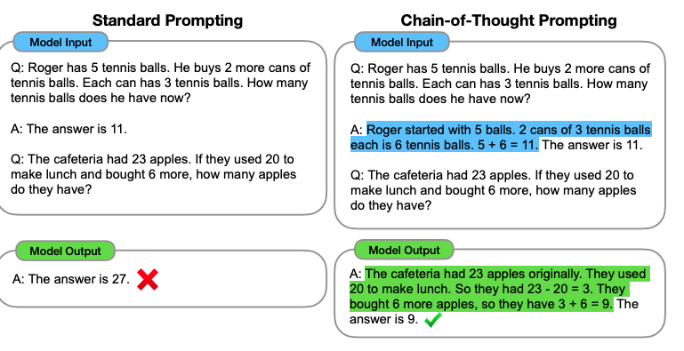
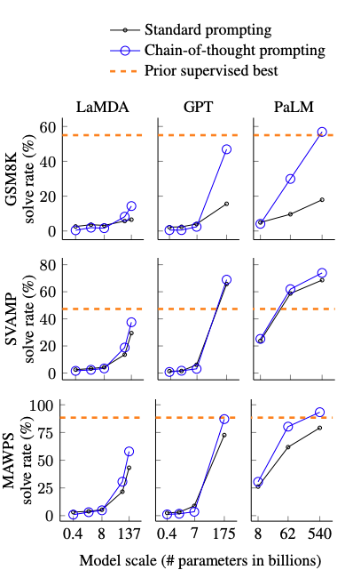

## Paper info

[Chain-of-Thought Prompting Elicits Reasoning in Large Language Models](https://arxiv.org/abs/2201.11903)  
Jason Wei, Xuezhi Wang, Dale Schuurmans, Maarten Bosma, et al.  
Google Research, Brain Team, 2022

## TL;DR

The authors demonstrate how reasoning capabilities emerge in large language models simply by providing reasoning examples in the prompts. They show that in-context few-shot chain-of-thought prompting significantly improves model performance on arithmetic, commonsense reasoning, and symbolic reasoning, especially at large model scale, as shown through experiments.

## Context

Scaling model parameters has proved to be effective and has significantly improved the performance of large language models across numerous natural language tasks. OpenAI GPT [1], GPT-2 [2], and GPT-3 [3] show that scaling up the parameters of the model improves overall reasoning capabilities. However, simply scaling up the parameters of these large language models doesn't guarantee better performance, especially on arithmetic, commonsense reasoning, and symbolic reasoning.

Previous research has tried two major approaches to enhance the reasoning capabilities of LLMs. The first approach revolves around training from scratch [4] or fine-tuning the LLMs [5] to generate natural language-based intermediate steps in the hope that the rationale leads to the correct answer. However, training and fine-tuning the model is costly, in terms of compute resources and large amounts of high-quality reasoning data. The second approach uses in-context learning to simply insert a prompt into the context without updating the model's parameters. This approach has three variants: zero-shot, one-shot, and few-shot, depending on the number of examples given in the model context [3]. This in-context few-shot learning also has a limitation: it doesn't significantly improve reasoning on tasks like math and logic, even for larger models.

## Main idea

This paper attempts to solve the limitations of both approaches by using in-context few-shot learning for reasoning tasks. The input consists of few-shot examples formatted as triplets of input, chain-of-thought reasoning, and output. Figure 1 further illustrates the difference between standard prompting and chain-of-thought prompting. This enables, in principle, the model to decompose problems into multi-step intermediate steps, effectively allocating compute tokens to the sub-problems requiring more effort. This also allows the model to use chain-of-thought reasoning steps and debug its trajectory. Furthermore, this chain-of-thought reasoning approach is applicable across various problem domains, allowing language models to perform complex reasoning without updating model parameters.

Figure 1: Standard prompting vs chain-of-thought prompting.

## Results

A notable outcome of the chain-of-thought prompting approach for large language models is a substantial performance increase on multiple mathematical reasoning benchmarks such as GSM8K, MAWPS, and SVAMP. As shown in Figure 2, chain-of-thought prompting improves performance mainly at large model scale. PaLM 540B achieved state-of-the-art performance on GSM8K without fine-tuning, exceeding fine-tuned GPT-3 with a verifier, demonstrating the effectiveness of the approach for large language models at scale.

Figure 2: Chain-of-thought vs standard prompting by model scale.

## References

[1] [Improving Language Understanding by Generative Pre-Training](https://cdn.openai.com/research-covers/language-unsupervised/language_understanding_paper.pdf)  
Alec Radford, Karthik Narasimhan, Tim Salimans, and Ilya Sutskever. OpenAI, 2018.

[2] [Language Models are Unsupervised Multitask Learners](https://cdn.openai.com/better-language-models/language_models_are_unsupervised_multitask_learners.pdf)  
Alec Radford, Jeffrey Wu, Rewon Child, David Luan, Dario Amodei, and Ilya Sutskever. OpenAI, 2019.

[3] [Language Models are Few-Shot Learners](https://arxiv.org/abs/2005.14165)  
Tom B. Brown, Benjamin Mann, Nick Ryder, et al. OpenAI, 2020.

[4] [Program Induction by Rationale Generation: Learning to Solve and Explain Algebraic Word Problems](https://arxiv.org/abs/1705.04146)  
Wang Ling, Dani Yogatama, Chris Dyer, and Phil Blunsom. 2017.

[5] [Training Verifiers to Solve Math Word Problems](https://arxiv.org/abs/2110.14168)  
Karl Cobbe, Vineet Kosaraju, Mohammad Bavarian, Jacob Hilton, Reiichiro Nakano, Christopher Hesse, and John Schulman. OpenAI, 2021.
