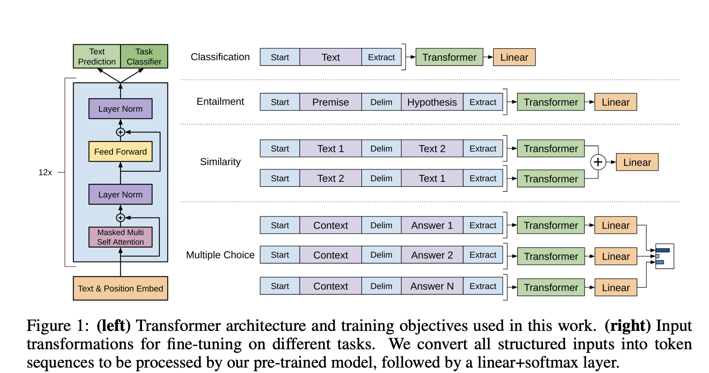

## Paper info

**Title:** [Language Models are Unsupervised Multitask Learners](https://cdn.openai.com/better-language-models/language_models_are_unsupervised_multitask_learners.pdf)

**Authors:** Alec Radford, Jeffrey Wu, Rewon Child, David Luan, Dario Amodei, Ilya Sutskever

**Year:** 2019

## TL;DR

This research presents GPT-2, a model based on the Transformer architecture. It demonstrates that language models can learn to multitask on a wide range of natural language processing tasks without explicit supervision.

## Context

The dominant machine learning approach trains models on a domain-specific dataset to excel as narrow experts through supervised learning. However, a slight change in the data's distribution renders these models unusable. These phenomena have been observed in reading comprehension, image captioning, and summarization systems, among others. This lack of generalization can mainly be attributed to task-specific training and the domain-specific nature of the training dataset used.

Several studies have utilized pre-training and supervised fine-tuning for language tasks. Mikolov et al. [1] and Collobert et al. [2] applied transfer learning by first learning word representation vectors, which could then be transferred to downstream tasks. Dai and Le [3] and Peters et al. [4] further extended this approach by using pre-trained recurrent neural networks to obtain contextual representations from sequences of words. Subsequent studies (Radford et al. [5]; Devlin et al. [6]) showed that task-specific architectures are no longer required for training. Benchmarks such as GLUE [7] and decaNLP [8] further motivated the development of models that can handle many NLP tasks within a single framework.

## Main idea

Rather than fine-tuning on task-specific data, this research explores a new design for a general-purpose model capable of performing downstream tasks in a zero-shot setting, without any additional training or fine-tuning of the original model parameters.

The central idea of this approach is to learn the joint distribution for a sequence of symbols [9] $(s_1, s_2, \ldots, s_n)$:

$$
p(x) = \prod_{i=1}^{n} p(s_i \mid s_1, \ldots, s_{i-1}).
$$

The paper utilizes Byte Pair Encoding (BPE), which provides a middle ground between character-level and word-level tokenization. Character-level tokenizers represent text using individual characters, resulting in substantially longer token sequences and consequently greater computational costs for sequence models. In contrast, word-level tokenizers can suffer from large vocabularies and poor handling of rare or unseen words, particularly in large-scale datasets such as the One Billion Word Benchmark [10]. BPE addresses these limitations by representing text using frequently occurring subword units, which allows it to reduce vocabulary size and efficiently represent unseen words.

## Model

The research uses the Transformer [11] based OpenAI GPT architecture [5] with a few modifications. In contrast to OpenAI GPT [5] shown in Figure 1, GPT-2 moves layer normalization to the input of each decoder block (pre-normalization) and adds a final layer normalization after the last block. The model has a vocabulary of 50,257 and a context size of 1,024 tokens.

Figure 1: OpenAI GPT architecture and input transformations for fine-tuning.

The authors introduced WebText, a 40-gigabyte dataset composed of approximately 8 million documents, and trained four versions of the GPT-2 model: the smallest with 117M parameters, equivalent to the original OpenAI GPT model [5]; two medium-sized models with 345M and 762M parameters; and a 1.5B-parameter version, which is an order of magnitude larger than the original OpenAI GPT.

## Results

The authors demonstrated that the largest GPT-2 model was able to match and exceed 3 of the 4 baseline models on the CoQA dataset, achieving a performance of 55 F1 without any training on CoQA's 127,000+ examples. This confirms the reasoning capacity of the language model in a zero-shot setting. Moreover, GPT-2 achieved state-of-the-art performance on 7 out of 8 tested language modeling datasets in a zero-shot setting. These results reveal the correlation between model size and zero-shot performance, demonstrating that language models can evolve from narrow, task-specific experts into competent generalists capable of performing across diverse NLP tasks.

## References

[1] Tomas Mikolov et al., [Efficient Estimation of Word Representations in Vector Space](https://arxiv.org/abs/1301.3781), 2013.

[2] Ronan Collobert et al., [Natural Language Processing (Almost) from Scratch](https://arxiv.org/abs/1103.0398), 2011.
[3] Andrew M. Dai and Quoc V. Le, [Semi-supervised Sequence Learning](https://arxiv.org/abs/1511.01432), 2015.
[4] Matthew E. Peters et al., [Deep Contextualized Word Representations](https://arxiv.org/abs/1802.06665), 2018.
[5] Alec Radford et al., [Improving Language Understanding by Generative Pre-Training](https://cdn.openai.com/research-covers/language-unsupervised/language_understanding_paper.pdf), 2018.
[6] Jacob Devlin et al., [BERT: Pre-training of Deep Bidirectional Transformers for Language Understanding](https://arxiv.org/abs/1810.04805), 2018.
[7] Alex Wang et al., [GLUE: A Multi-Task Benchmark and Analysis Platform for Natural Language Understanding](https://arxiv.org/abs/1804.07461), 2018.
[8] Bryan McCann et al., [The Natural Language Decathlon: Multitask Learning as Question Answering](https://arxiv.org/abs/1806.08730), 2018.
[9] Yoshua Bengio et al., [A Neural Probabilistic Language Model](https://www.jmlr.org/papers/volume3/bengio03a/bengio03a.pdf), 2003.
[10] Rami Al-Rfou et al., [Character-Level Language Modeling with Deeper Self-Attention](https://arxiv.org/abs/1808.04444), 2018.

[11] Ashish Vaswani et al., [Attention Is All You Need](https://arxiv.org/abs/1706.03762), 2017.
