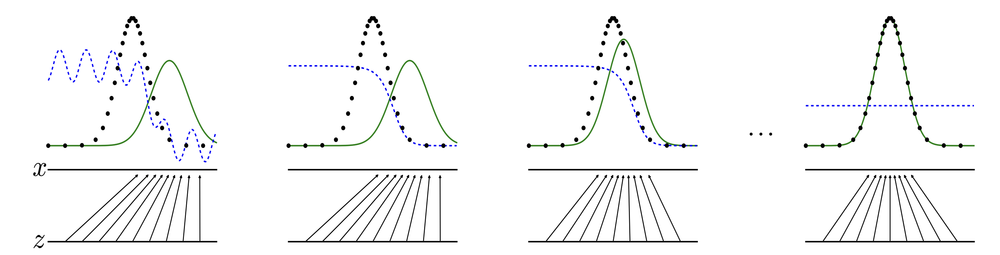

## Paper info

**Title:** [Generative Adversarial Nets](https://arxiv.org/abs/1406.2661)

**Authors:** Ian J. Goodfellow et al.

## TL;DR

The paper addresses the fundamental problem in training Generative Models—the challenge of modeling intractable and high-dimensional probabilistic computations. The authors propose an architecture composed of a generative model and a discriminative model that compete to minimize and maximize the loss simultaneously. If both networks are trained well enough, the generator’s distribution matches the data distribution, so the discriminator cannot tell samples apart. The paper demonstrates the effectiveness of the approach through qualitative and quantitative evaluation.

## Context

Machine Learning models can broadly be classified into two classes, namely discriminative and generative. Discriminative models learn to model a decision boundary between classes; thus, they learn the conditional distribution $P(Y|X)$. Their use is limited to discriminative classification tasks. Logistic Regression, Decision Trees, and SVMs are examples of discriminative models. Generative models, on the other hand, learn the joint distribution $P(X,Y)$ of the data and can generate new instances—Naive Bayes and Gaussian Mixture Model are examples of generative models.

## Main idea

Generative Adversarial Networks (GANs) are generative models that learn to generate data similar to the training set. They consist of two major components: a generative model and a discriminative model—adversaries competing with each other. A good analogy given in the paper is that the generator can be thought of as a counterfeiter trying to generate fake coins, and the discriminator as a police officer trying to detect counterfeit coins.

The generator produces an output $x = G(z)$, where $G$ is a differentiable multi-layer perceptron and the input $z$ is a noise variable sampled from a known distribution such as the standard Gaussian. The aim is to learn a probability distribution $p_g$ using $G(z; \theta_g)$.

The discriminator, $D(x; \theta_d)$, is the second differentiable multi-layer perceptron that classifies whether the data came from $p_{\text{data}}$ instead of $p_g$. Therefore, the discriminator is trained to maximize $\log D(x)$ on real data and $\log(1 - D(G(z)))$ on generated samples. The generator is trained to minimize $\log(1 - D(G(z)))$.

Figure 1: Discriminator (dashed blue), data distribution (dotted black), and generator distribution (solid green) during adversarial training.

Therefore, this can be formulated as a minimax optimization with a value function $V(G, D)$, where the generator tries to shift its distribution toward the real distribution and the discriminator tries to learn the perfect boundary, as shown in Figure 1.

$$
\min_G \max_D V(D, G) = \mathbb{E}_{x \sim p_{\text{data}}(x)}[\log D(x)] + \mathbb{E}_{z \sim p_z(z)}[\log(1 - D(G(z)))]
$$

$$
D^*(x) = \frac{p_{\text{data}}(x)}{p_{\text{data}}(x) + p_g(x)}
$$

Substituting the discriminator into the value function yields:

$$
C(G) = \mathbb{E}_{x \sim p_{\text{data}}(x)}\left[\log \frac{p_{\text{data}}(x)}{p_{\text{data}}(x) + p_g(x)}\right] + \mathbb{E}_{x \sim p_g(x)}\left[\log \frac{p_g(x)}{p_{\text{data}}(x) + p_g(x)}\right]
$$

After several steps of training, if both distributions overlap perfectly, $p_{\text{data}}(x) = p_g(x)$, $D(x) = \frac{1}{2}$. At this step, the discriminator is unable to differentiate between a sample from the training and the generated data.

## Question

What happens if we have a very strong discriminator?

How do we train a conditional generative model $p(x|c)$?
