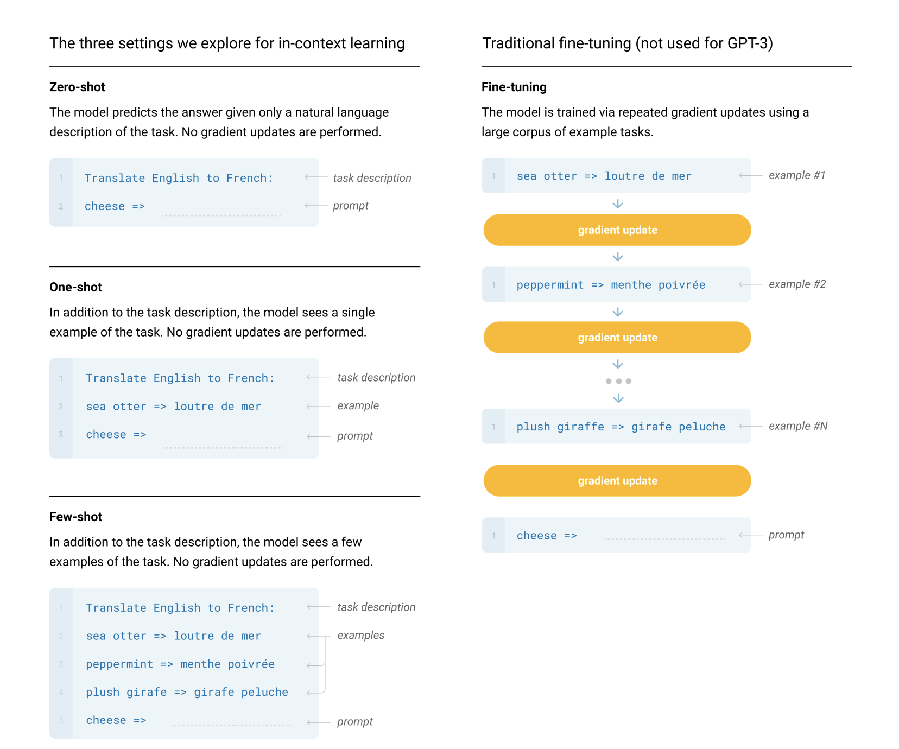
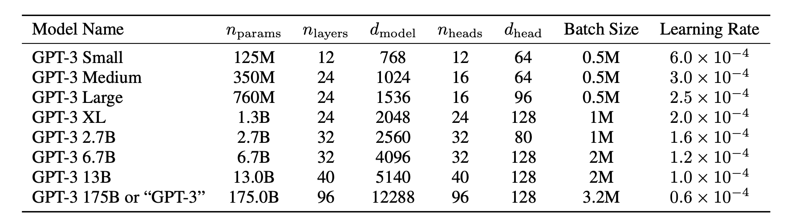

## Paper info

**Title:** [Language Models are Few-Shot Learners](https://arxiv.org/abs/2005.14165)

**Authors:** Tom B. Brown, Benjamin Mann, Nick Ryder, Melanie Subbiah, Jared Kaplan, et al.

**Year:** 2020

## TL;DR

The authors train a new version of the GPT models, specifically GPT-3, and demonstrate that parameter scaling yields competitive gains in task-agnostic few-shot performance across several natural language tasks.

## Context

Pre-trained language models featured a trend towards shared representations across different natural language tasks, resulting in significant progress in tasks such as reading comprehension, question answering, text summarization, machine translation, and more. While task-agnostic architectures have been favored, they still require fine-tuning on a downstream dataset to achieve strong performance. Often, this process requires thousands or tens of thousands of examples; collecting and labeling new data for every new downstream task becomes infeasible.

Moreover, Hendrycks et al. [1] hypothesize that the pre-training and fine-tuning approach for larger models tends to train models to absorb a large amount of information during the initial steps. The fine-tuning steps on specific training data, however, do not result in better out-of-distribution performance. This motivates the need to design a highly generalizable model capable of seamlessly utilizing diverse skills to handle a wide range of natural language tasks simultaneously.

## Main idea

The authors of this paper propose meta-learning—a technique that allows models to perform downstream NLP tasks through in-context learning, modifying the model's context without updating its parameters. In the context of their paper: zero-shot learning refers to evaluating their models on a downstream task with just a description of the task without giving any examples; one-shot learning evaluates performance by adding one example in addition to the description of the task; few-shot learning evaluates performance by using 10–100 examples.

These techniques are better illustrated in Figure 2.1.

Figure 2.1: Zero-shot, one-shot, and few-shot evaluation, compared with traditional fine-tuning.

## Model

The research reuses the GPT-2 [2] model architecture, including BPE tokenization, pre-normalization, and modified initialization. The one architectural change is using alternating dense and locally banded sparse attention patterns in the layers of the transformer, similar to the Sparse Transformer [3]. They trained eight different versions of the GPT-3 models, ranging from 125M to 175B parameters, as shown in Table 2.1. This allows them to test the scaling laws [4] and whether scaling continues to improve few-shot performance on downstream tasks.

Table 2.1: Sizes, architectures, and learning hyper-parameters of the models which we trained. All models were trained for a total of 300 billion tokens.

The authors used a mixture of training data—Common Crawl (filtered), WebText2, Books1, Books2, and Wikipedia—to train their models. The larger variants of the GPT-3 models require a larger batch size but a lower learning rate.

## Results

The results show that GPT-3 attains promising results in zero-shot, one-shot, and few-shot learning evaluations even when compared to state-of-the-art models, despite some of them being fine-tuned on the downstream tasks. It achieved competitive results on the CoQA dataset with zero-shot, one-shot, and few-shot performance of 81.5 F1, 84.0 F1, and 85.0 F1, respectively. On the TriviaQA dataset, it achieved a zero-shot performance of 64.3%, one-shot performance of 68.0%, and state-of-the-art few-shot performance of 71.2% in the closed-book setting.

Furthermore, GPT-3 showed high proficiency in unscrambling words, performing arithmetic, and using novel words in sentences. However, it still struggled with datasets that test natural language reasoning, such as the ANLI dataset, and other language datasets such as RACE, which tests reading comprehension.

## References

[1] Dan Hendrycks et al., [Pretrained Transformers Improve Out-of-Distribution Robustness](https://arxiv.org/abs/2004.06100), 2020.

[2] Alec Radford et al., [Language Models are Unsupervised Multitask Learners](https://cdn.openai.com/better-language-models/language_models_are_unsupervised_multitask_learners.pdf), 2019.

[3] Rewon Child et al., [Generating Long Sequences with Sparse Transformers](https://arxiv.org/abs/1904.10509), 2019.

[4] Jared Kaplan et al., [Scaling Laws for Neural Language Models](https://arxiv.org/abs/2001.08361), 2020.
