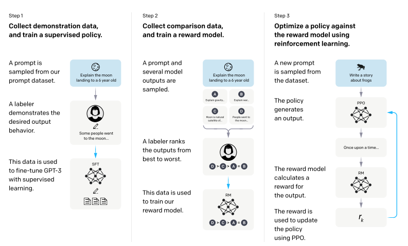

## Paper info

[Training language models to follow instructions with human feedback](https://arxiv.org/abs/2203.02155)  
Long Ouyang, Jeff Wu, Xu Jiang, Diogo Almeida, et al.  
OpenAI, 2022

## TL;DR

The paper applies a reinforcement learning-based fine-tuning approach to better align model output with users' intent. The research produced the InstructGPT model, which has 100 times fewer parameters than GPT-3 175B, showing that smaller models can outperform larger ones.

## Context

The dominant approach for training large language models has been to optimize the next-token prediction objective. All the variants of OpenAI GPT [1], GPT-2 [2], and GPT-3 [3] have been trained using this objective. However, these models tend to generate output that is toxic, untruthful, and unhelpful. This misalignment stems from the fact that the models aren't trained to generate output that aligns with the users' intent, which is imperative for the adoption of large language models across different applications.

## Main idea

The main contribution of this paper is aligning GPT-3 language model variants using the Reinforcement Learning from Human Feedback (RLHF) [4] fine-tuning approach. The RLHF approach utilizes human feedback to train a reward model used to fine-tune an LLM to generate output in line with users' preferences.

The model is trained in three steps (Figure 1). The authors collected a dataset of prompt-output pairs with desired outputs submitted through the OpenAI API and used 40 contractors to label the prompts. This dataset is used to train a baseline model using next-word prediction. Similarly, the authors collect a larger dataset to compare outputs for a given prompt. In this second step, the dataset is used to train a reward model to choose the output that the labelers prefer. Lastly, in the training process, the reward model is utilized to fine-tune the language model trained on the supervised learning baseline using the Proximal Policy Optimization (PPO) algorithm [5]. The authors use this process to align the model's output to users' intent and produce a model called InstructGPT.

Figure 1: A diagram illustrating the three steps of the method: (1) supervised fine-tuning (SFT), (2) reward model (RM) training, and (3) reinforcement Learning.

**Training description**

As mentioned above, supervised fine-tuning is used to train the baseline GPT-3 models. Training is performed for 16 epochs using a cosine learning rate decay scheduler and a residual dropout of 0.2.

Objective:

$$
\prod_{i=1}^{n} p\left(s_i \mid s_1, \ldots, s_{i-1}\right)
$$

A reward model is trained to assign a scalar value to a prompt-output pair by learning to differentiate between a preferred output and an undesired output for a given prompt.

$$
\text{loss}(\theta) = -\frac{1}{\binom{K}{2}} \mathbb{E}_{(x,y_w,y_l)\sim D} \left[\log \left(\sigma \left(r_\theta(x, y_w) - r_\theta(x, y_l)\right)\right)\right]
$$

The reinforcement learning-based LLM lives in a bandit environment in which the LLM makes a single decision and receives a corresponding reward. The RL objective is:

$$
\text{objective}(\phi) = \mathbb{E}_{(x,y)\sim D_{\pi_\phi^{\text{RL}}}} \left[r_\theta(x, y) - \beta \log \frac{\pi_\phi^{\text{RL}}(y | x)}{\pi^{\text{SFT}}(y | x)}\right] + \gamma \mathbb{E}_{x\sim D_{\text{pretrain}}} \left[\log\left(\pi_\phi^{\text{RL}}(x)\right)\right]
$$

where:

- $r_\theta(x, y)$ is the reward of the output $y$ for prompt $x$ from the reward model
- $\log \frac{\pi_\phi^{\text{RL}}(y | x)}{\pi^{\text{SFT}}(y | x)}$ is the KL divergence between the RL policy and SFT policy, with scaling coefficient $\beta$
- $\mathbb{E}_{x\sim D_{\text{pretrain}}} \left[\log\left(\pi_\phi^{\text{RL}}(x)\right)\right]$ is the pretraining distribution, which we want to conserve while we fine-tune

The objective above is then optimized using Proximal Policy Optimization (PPO). PPO acts as a surrogate optimizer, using its clipped objective $L^{\text{CLIP}}$ to take stable steps toward maximizing the RLHF objective.

$L^{\text{CLIP}}$ is defined as:

$$
L^{\text{CLIP}}(\theta) = \mathbb{E}_t \left[ \min \left( r_t(\theta) A_t,\, \text{clip} \left( r_t(\theta), 1-\epsilon, 1+\epsilon \right) A_t \right) \right]
$$

where $r_t(\theta)$ is the probability ratio:

$$
r_t(\theta) = \frac{\pi_\theta(a_t|s_t)}{\pi_{\theta_{\text{old}}}(a_t|s_t)}
$$

and $A_t$ is the advantage function (how much better action $a_t$ is than expected).

Expanding this, we get:

$$
L^{\text{CLIP}}(\theta) = \mathbb{E}_t \left[ \min \left( \frac{\pi_\theta(a_t|s_t)}{\pi_{\theta_{\text{old}}}(a_t|s_t)} A_t,\, \text{clip} \left( \frac{\pi_\theta(a_t|s_t)}{\pi_{\theta_{\text{old}}}(a_t|s_t)}, 1-\epsilon, 1+\epsilon \right) A_t \right) \right]
$$

where $\epsilon = 0.2$. The clipping prevents the policy from changing too much in a single update by limiting the ratio to the range $[1-\epsilon, 1+\epsilon]$, making training more stable.

## Results

Despite having 100 times fewer parameters than GPT-3 (175B parameters), InstructGPT (1.3B parameters) outperformed GPT-3 on several benchmarks. Both models were evaluated by labelers using a subset of the labeled data held out from the training stage. Labelers prefer the output of the InstructGPT model over the outputs of the GPT-3 model. Moreover, their evaluation on the TruthfulQA [6] benchmark dataset shows that the InstructGPT model is twice as truthful as GPT-3. InstructGPT also shows some improvements in toxicity tested on the RealToxicityPrompts [7] dataset; however, it didn't improve bias based on tests on Winogender [8] and CrowS-Pairs [9] datasets. Further comparison could be found in the paper.

## References

[1] [Improving Language Understanding by Generative Pre-Training](https://cdn.openai.com/research-covers/language-unsupervised/language_understanding_paper.pdf)  
Alec Radford, Karthik Narasimhan, Tim Salimans, and Ilya Sutskever. OpenAI, 2018.

[2] [Language Models are Unsupervised Multitask Learners](https://cdn.openai.com/better-language-models/language_models_are_unsupervised_multitask_learners.pdf)  
Alec Radford, Jeffrey Wu, Rewon Child, David Luan, Dario Amodei, and Ilya Sutskever. OpenAI, 2019.

[3] [Language Models are Few-Shot Learners](https://arxiv.org/abs/2005.14165)  
Tom B. Brown, Benjamin Mann, Nick Ryder, et al. OpenAI, 2020.

[4] [Deep Reinforcement Learning from Human Preferences](https://arxiv.org/abs/1706.03741)  
Paul F. Christiano, Jan Leike, Tom B. Brown, Miljan Martic, Shane Legg, and Dario Amodei. 2017.

[5] [Proximal Policy Optimization Algorithms](https://arxiv.org/abs/1707.06347)  
John Schulman, Filip Wolski, Prafulla Dhariwal, Alec Radford, and Oleg Klimov. 2017.

[6] [TruthfulQA: Measuring How Models Mimic Human Falsehoods](https://arxiv.org/abs/2109.07958)  
Stephanie Lin, Jacob Hilton, and Owain Evans. 2021.

[7] [RealToxicityPrompts: Evaluating Neural Toxic Degeneration in Language Models](https://arxiv.org/abs/2009.11462)  
Samuel Gehman, Suchin Gururangan, Maarten Sap, Yejin Choi, and Noah A. Smith. 2020.

[8] [Gender Bias in Coreference Resolution](https://arxiv.org/abs/1804.09301)  
Rachel Rudinger, Jason Naradowsky, Brian Leonard, and Benjamin Van Durme. 2018.

[9] [CrowS-Pairs: A Challenge Dataset for Measuring Social Biases in Masked Language Models](https://arxiv.org/abs/2010.00133)  
Nikita Nangia, Clara Vania, Rasika Bhalerao, and Samuel R. Bowman. 2020.
