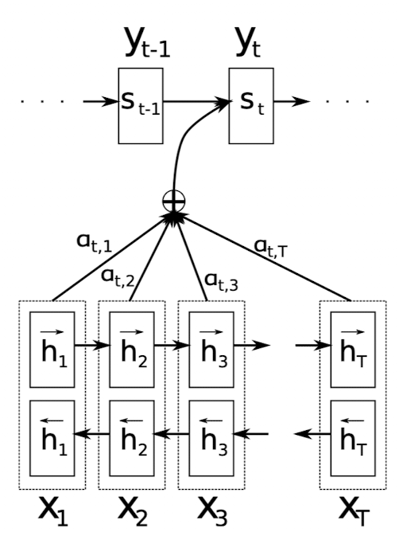
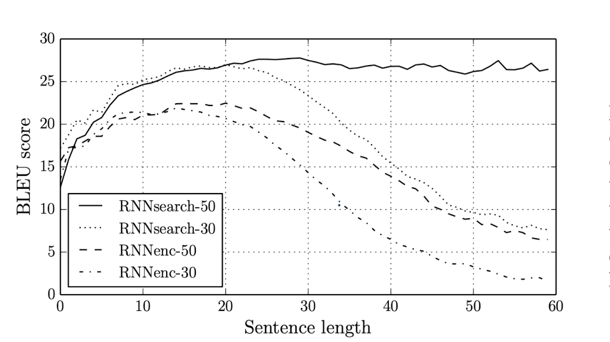

## Paper info

**Title:** [Neural Machine Translation by Jointly Learning to Align and Translate](https://arxiv.org/abs/1409.0473)

**Authors:** Dzmitry Bahdanau, Kyunghyun Cho, Yoshua Bengio

## TL;DR

Encoder-Decoder Neural Machine Translation systems struggle with long-sentence translations due to their design—information loss is inevitable when a fixed-length vector generated by the encoder is used by the decoder to generate the translation. To address this issue, the authors introduced a learnable alignment model at the decoder that, at each decoding step, weights the relevance of each encoder hidden state to the word being predicted. The researchers performed a comparative analysis of three models: RNNsearch, an encoder-decoder model utilizing soft alignment that they trained; RNNencdec, a baseline encoder-decoder model; and Moses, a phrase-based translation system. The results confirmed their intuition that soft alignment would help especially on long sentences.

## Context

Machine Translation is the process of translating text from one language to another using a computer program. At the time of this publication, one common Machine Translation approach was Phrase-based Machine Translation, and Neural Machine Translation was an emerging topic. Phrase-based Machine Translation is a statistical approach that translates groups of words or phrases based on a learned bilingual corpus. Neural Machine Translation relies on training a single model to take in sentences in the source language and translate them into the target language.

A number of studies propose an Encoder-Decoder RNN architecture to learn the mapping between a source language and a target language. This architecture consists of two components: an encoder to obtain a representation of the source language and a decoder to autoregressively translate into the target language.

### Encoder

The encoder takes a sequence of input vectors $x = (x_1, \cdots, x_{T_x})$ and produces a context vector $c$—a dense representation of the input. RNNs are commonly used:

$$
h_t = f(x_t, h_{t-1}), \quad c = q(\{h_1, \cdots, h_{T_x}\})
$$

where $h_t$ is the hidden state at time $t$, and $f$ and $q$ are non-linear functions that transform the input and the hidden states. In this work, the encoder is bidirectional: each $h_j$ concatenates forward and backward hidden states, as shown in Figure 1.

### Decoder

The RNN decoder is trained to autoregressively predict $y_t$ by taking $y_1, \ldots, y_{t-1}$ and the dense representation context vector $c$ from the encoder.

$$
p(y) = \prod_{t=1}^{T_y} p(y_t \mid \{y_1, \cdots, y_{t-1}\}, c), \quad y = (y_1, \cdots, y_{T_y})
$$

In an RNN, the conditional probability can be modeled using $g$, a potentially multi-layered nonlinear function that predicts the output $y_t$ given the previous word $y_{t-1}$, the hidden state $s_t$, and the context vector $c$ from the encoder.

$$
p(y_t \mid \{y_1, \cdots, y_{t-1}\}, c) = g(y_{t-1}, s_t, c)
$$

## Main idea

The main contribution of this research is the introduction of a learnable attention mechanism to weigh the importance of each encoder hidden state with respect to the current word to be predicted. This allows the model to learn a soft-alignment between the source and target language. With attention, the decoder hidden state $s_i$ at time $i$ is computed as:

$$
s_i = f(s_{i-1}, y_{i-1}, c_i)
$$

where

$$
c_i = \sum_{j=1}^{T_x} \alpha_{ij} h_j
$$

and

$$
\alpha_{ij} = \frac{\exp(e_{ij})}{\sum_{k=1}^{T_x} \exp(e_{ik})}
$$

where $e_{ij} = a(s_{i-1}, h_j)$ is the alignment model that scores how well the encoder hidden state at position $j$ aligns with the decoder state at step $i$. This attention mechanism alleviates the need for the encoder to generate a fixed-length context vector. Figure 1 illustrates this architecture.

Figure 1: Soft-alignment attention over encoder hidden states.

## Results

To measure the performance of their approach, researchers conducted a comparative analysis of three models: RNNsearch, an encoder-decoder model utilizing soft alignment that they trained; RNNencdec, a baseline encoder-decoder model; and Moses, a phrase-based translation system. RNNsearch and RNNencdec were both trained on WMT '14, an English-French parallel dataset containing a total of 850M words. Moses uses an extra monolingual dataset (418M words) in addition to the WMT '14 parallel dataset.

Figure 2: BLEU score vs. sentence length for RNNsearch and RNNencdec.

The research compared RNNsearch with RNNencdec models on a test set using the BLEU score. As shown in Figure 2, the performance of RNNencdec sharply drops when the sentence length increases, while RNNsearch holds up, confirming that soft alignment helps especially on long sentences. Moreover, the RNNsearch model performed on par with the Moses Phrase-Based translation system. Considering the fact that Moses uses an additional monolingual dataset with an extra 418M words, the results show that RNNsearch is a promising step toward stronger neural machine translation.
