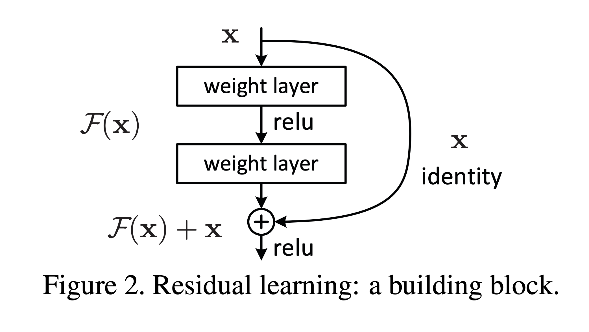

## Paper info

**Title:** [Deep Residual Learning for Image Recognition](https://arxiv.org/abs/1512.03385)

**Authors:** Kaiming He, Xiangyu Zhang, Shaoqing Ren, Jian Sun

## TL;DR

Kaiming et al. address the degradation problem—the performance decline in deeper models in comparison to their shallower counterparts. The authors propose Residual learning with identity mapping and perform several experiments to demonstrate the effectiveness of their methods.

## Context

Deep neural networks have led to breakthroughs across a myriad of AI applications, ranging from image classification and object detection to natural language processing. These AI applications benefit from stacking deep neural models. However, it’s been observed that the performance of the model decreases as the depth of the layers increases [1, 2], mainly due to vanishing and exploding gradients. These challenges have been addressed mainly by utilizing normalized initialization and normalized layers.

However, as the depth of the network increases, a new degradation problem arises—performance saturates, and it’s not due to overfitting. This indicates that optimizing a deeper network isn’t identical to optimizing a shallower network and requires intuitive ways to overcome the performance degradation challenge.

## Main idea

The authors hypothesize that it is difficult for stacked layers to learn identity mappings directly, and present an approach that learns a residual function $F(x)$ with an identity shortcut when constructing deeper models. As shown in Figure 2, subsequent layers are stacked and designed with the formulation $F(x) + x$, with short connections that simply perform identity mapping by adding the input of the residual learning block to the output. This formulation is inspired by the counterintuitive fact that deeper networks should not perform worse than shallower ones.

Figure 2: Residual learning block with identity shortcut ($F(x) + x$).

## Conclusion

The authors conducted comprehensive experiments on the ImageNet dataset and CIFAR-10 and demonstrated that deep residual networks are simple to optimize. They also show performance gains in comparison with plain networks. Furthermore, the authors substantiated their claims by winning first place in the ILSVRC 2015 classification competition, ImageNet detection, ImageNet localization, COCO detection and segmentation in ILSVRC and COCO 2015 competitions.

## References

**[1]** Y. Bengio, P. Simard, and P. Frasconi. Learning long-term dependencies with gradient descent is difficult. _IEEE Transactions on Neural Networks_, 5(2):157–166, 1994.

**[2]** X. Glorot and Y. Bengio. Understanding the difficulty of training deep feedforward neural networks. In _AISTATS_, 2010.
