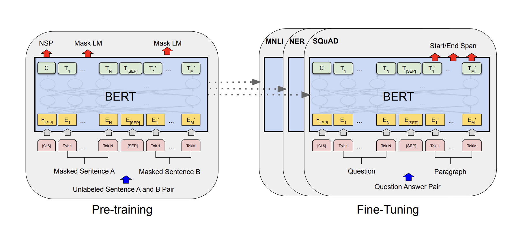
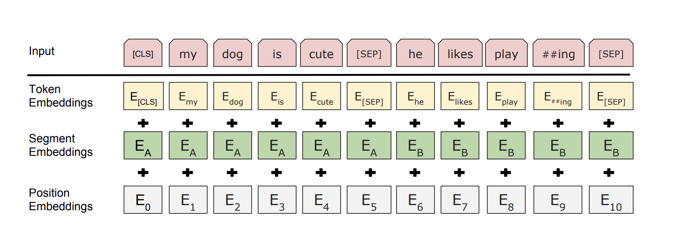

## Paper info

**Title:** [BERT: Pre-training of Deep Bidirectional Transformers for Language Understanding](https://arxiv.org/abs/1810.04805)

**Authors:** Jacob Devlin, Ming-Wei Chang, Kenton Lee, Kristina Toutanova

**Year:** 2018

## TL;DR

The paper introduces BERT—Bidirectional Encoder Representations from Transformers—which is pre-trained on two objectives using unlabeled data. The authors fine-tuned the pre-trained model on sentence-level and token-level tasks, achieving state-of-the-art performance and outperforming many task-specific architectures.

## Context

Two main methods exist for applying a pre-trained model to a downstream task: the feature-based approach and the fine-tuning approach. In the feature-based approach, the pre-trained weights are kept frozen, and a separate network is trained on top of the pre-trained model with a new objective on the downstream task. On the other hand, the fine-tuning approach trains all the parameters of the pre-trained model on the downstream task with a new objective.

This research introduces BERT—Bidirectional Encoder Representations from Transformers, a model pre-trained on unlabeled data across two tasks, mainly Masked LM and Next Sentence Prediction. This unified architecture, as illustrated in Figure 1, is the first fine-tuning-based representation model to achieve state-of-the-art performance on a large suite of sentence-level and token-level tasks, outperforming many task-specific architectures.

Figure 1: BERT pre-training with Masked LM and Next Sentence Prediction, and fine-tuning on downstream tasks such as MNLI, NER, and SQuAD.

## Main idea

BERT is a multi-layer bidirectional Transformer encoder based on Vaswani et al. [1]. Some important input and output representations are the first input classification token `[CLS]`, whose final hidden state represents the entire sequence for classification tasks. Also, as shown in Figure 2, sentences are separated by a special token `[SEP]`.

Figure 2: BERT input format with `[CLS]`, `[SEP]`, and segment embeddings.

## Pre-training

The first pre-training objective for this bidirectional language model is Masked LM. Bidirectional language models can be more powerful than a left-to-right or right-to-left model. A bidirectional model can trivially predict the target word without actually learning anything useful because the bidirectional conditioning would allow it to indirectly see the target in the input sequence. Thus, it requires masking the target word. Compared to denoising autoencoders that reconstruct the entire input sequence, BERT learns to predict only the masked words.

The second pre-training objective is the binarized Next Sentence Prediction (NSP) using a monolingual corpus. The assumption was that this helps the model learn the relationship between sentences. However, subsequent research in RoBERTa [2] discovered that the NSP objective contributed little and sometimes degraded performance.

## Conclusion

The authors trained a bidirectional representation model using an unsupervised approach and demonstrated the effectiveness of pre-training and transfer learning, achieving state-of-the-art results on MNLI, SQuAD, and other benchmarks.

## References

[1] Ashish Vaswani et al., [Attention Is All You Need](https://arxiv.org/abs/1706.03762), 2017.

[2] Yinhan Liu et al., [RoBERTa: A Robustly Optimized BERT Pretraining Approach](https://arxiv.org/abs/1907.11692), 2019.
