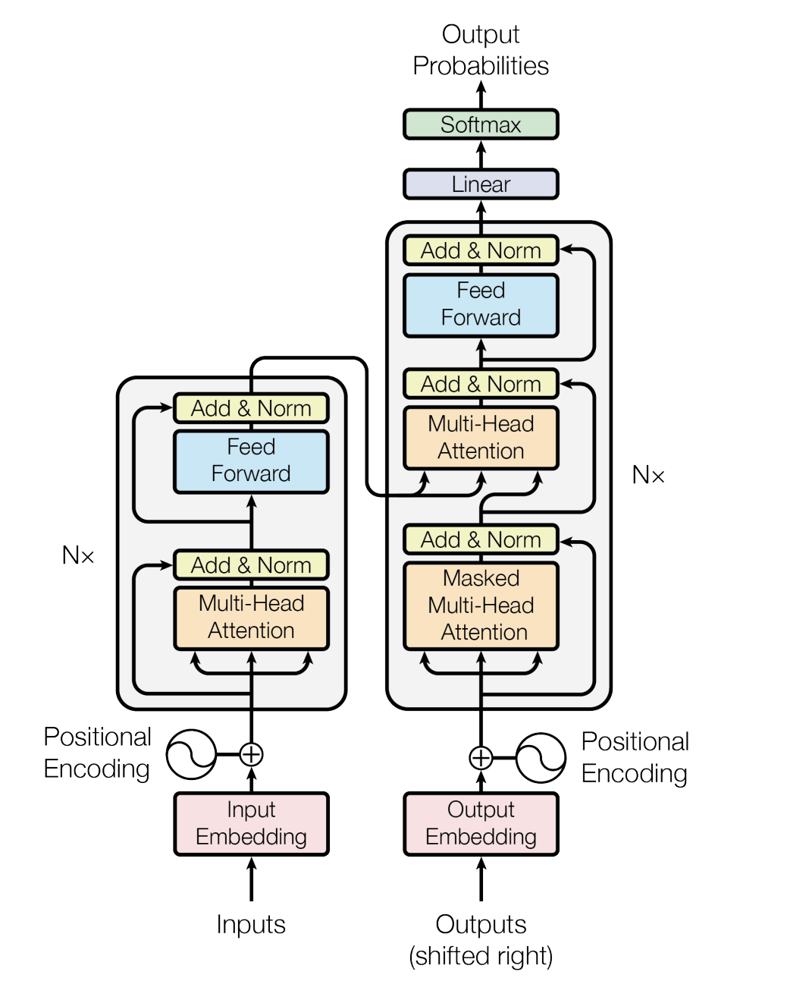
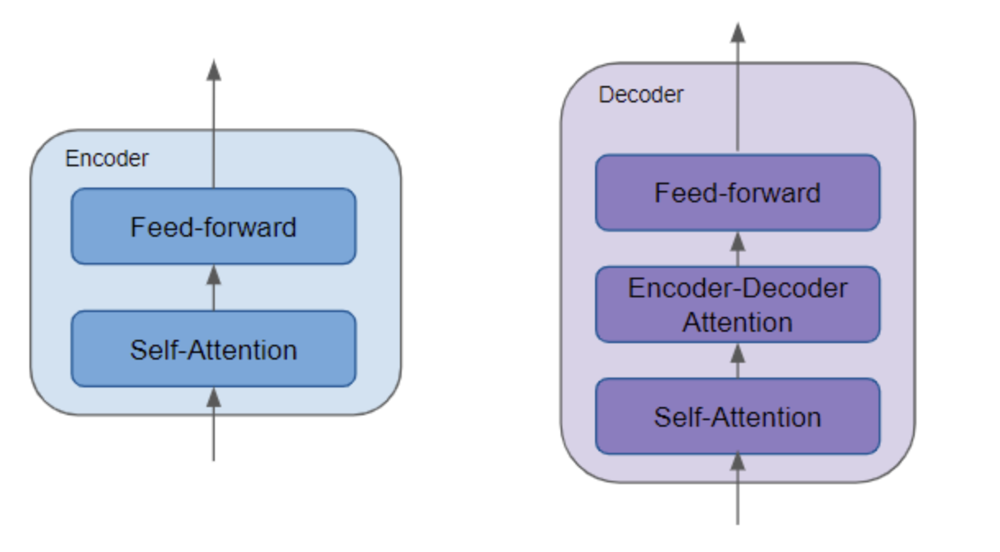
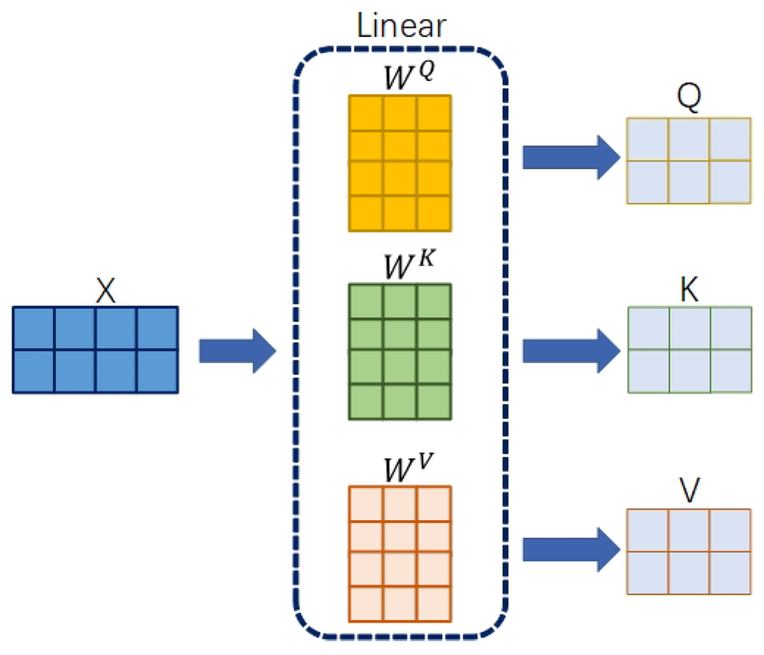
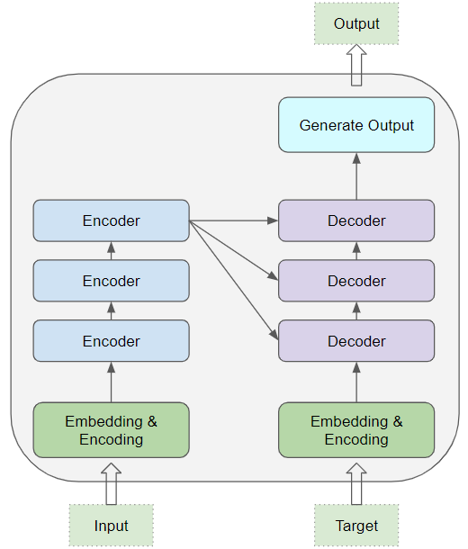
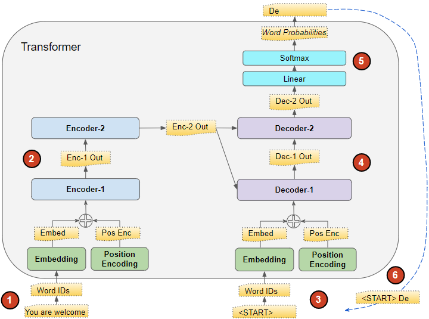

## Paper info

**Title:** [Attention Is All You Need](https://arxiv.org/abs/1706.03762)

**Authors:** Ashish Vaswani, Noam Shazeer, Niki Parmar, Jakob Uszkoreit, Llion Jones, Aidan N. Gomez, Łukasz Kaiser, Illia Polosukhin

## TL;DR

This research introduces Transformers, an architecture that relies entirely on self-attention and has been proven effective across numerous applications and myriad domains. They are simple to parallelize and take less time to train. This research confirms the effectiveness of their proposed architecture by achieving state-of-the-art results on WMT 2014 English-to-German and English-to-French translation tasks.

## Context

Recurrent neural networks, Long Short-Term Memory, and gated-recurrent-based encoder-decoder architectures have been the dominant approaches for modeling transduction tasks—tasks requiring sequence-to-sequence modeling. The sequential nature of these recurrent architectures inherently makes it impossible to parallelize and speed up training due to how sequences of inputs are processed. The hidden state, $h_t$, at time step $t$ depends on the hidden state $h_{t-1}$ at time step $t-1$. This creates significant speed inefficiencies.

Extended Neural GPUs, ByteNet, and ConvS2S have been proposed to overcome the inherent challenges of sequential computation in recurrent networks. They address this using convolutional neural networks as building blocks in their designs to extract a contextual representation for each position in the input sequence in parallel. However, they struggle to learn long-term dependencies between distant positions in the input sequence.

The authors propose the Transformer, an architecture that utilizes self-attention, also known as intra-attention, which mitigates the drawbacks of the sequential models.

Figure 1: The Transformer encoder-decoder architecture.

## Main idea

The Transformer architecture is mainly composed of 6 identical encoder and decoder blocks.

### Encoder

The Transformer architecture has 6 encoder blocks. Each encoder block is composed of a multi-head self-attention layer with residual connection and normalization, followed by a position-wise feed-forward network with residual connection and normalization.

### Decoder

The Transformer decoder consists of 6 decoder blocks. Each of these decoder blocks has a very similar architecture to the encoder blocks except that decoder blocks have two multi-head attention layers instead of one. The first is a masked multi-head self-attention layer that prevents positions from attending to subsequent positions. The second multi-head attention layer takes in the output of the last encoder, which passes the contextual representation at the decoding step. Each layer is followed by a residual connection and normalization.

Figure 2: Encoder block (Self-Attention, Feed-forward) and Decoder block (Self-Attention, Encoder-Decoder Attention, Feed-forward).

## Self-Attention

Self-Attention is a mechanism that allows transformers to compute the importance of different inputs and their surrounding sequence. It has three main components: Query, Key, and Value. Each of these is a vector obtained by passing an input to a Linear Layer, as shown in Figure 3.

Figure 3: Linear projections of the input into Query, Key, and Value matrices.

The Query vector represents the current position for which we compute attention scores against all Key vectors in the sequence.

The Key vector pertains to positions in the sequence that are compared against the Query. In the encoder, Keys come from all positions; in the decoder's masked self-attention, Keys come only from prior positions.

The Value vector provides the actual content that is aggregated to produce the output representation.

$$
q_i = W^Q x_i; \quad k_i = W^K x_i; \quad v_i = W^V x_i
$$

$$
\text{Attention}(Q, K, V) = \text{softmax}\left(\frac{QK^T}{\sqrt{d_k}}\right)V
$$

The attention scores are scaled by $\sqrt{d_k}$ to prevent the dot products from becoming too large, which would make the gradients unstable during training.

## Multi-Head attention

Multi-Head attention is a mechanism that introduces several self-attention heads, with each head having individual learned weight matrices $W^Q$, $W^K$, and $W^V$. They are computed in parallel to augment the inputs in a sequence, allowing them to describe how inputs in the sequence relate to each other in more than one way.

$$
\text{MultiHead}(Q, K, V) = \text{Concat}(\text{head}_1, \ldots, \text{head}_h)W^O
$$

where $\text{head}_i = \text{Attention}(QW_i^Q, KW_i^K, VW_i^V)$.

Figure 4: Encoder-decoder stack; decoder blocks attend to encoder outputs via multi-head attention.

In the decoder's encoder-decoder attention layer, the Key and Value matrices come from the encoder output, while the Query comes from the previous decoder layer. In the encoder self-attention layers, Query, Key, and Value all come from the same previous encoder layer.

## Position-wise Feed-Forward Network

Position-wise Feed-Forward Network is a layer applied to the output of each input token position individually. It contains two linear layers with a ReLU activation in between.

$$
\text{FFN}(x) = \max(0, xW_1 + b_1)W_2 + b_2
$$

## Embeddings and Softmax

In this research, the authors share a weight matrix for learning the input and output embeddings. Softmax is used to predict the next-token probabilities.

## Positional Encoding

To enable the model to learn about the order of the sequence, the authors use sinusoidal positional encodings. Since sinusoidal positional encoding is simply a mathematical formula, it can extrapolate to sequences longer than those seen during training.

$$
PE_{(pos, 2i)} = \sin\left(\frac{pos}{10000^{2i/d_{\text{model}}}}\right)
$$

$$
PE_{(pos, 2i+1)} = \cos\left(\frac{pos}{10000^{2i/d_{\text{model}}}}\right)
$$

where $pos$ is the position of the token in the sequence, and $i$ is the index of the dimension in the positional encoding vector.

Figure 5: The inference flow of the Transformer showing how input tokens pass through embeddings and positional encodings, then through stacked encoder blocks, with the encoder output feeding into the decoder blocks alongside the target sequence embeddings to generate output word probabilities autoregressively. [1]

## Conclusion

The authors demonstrated the generalizability and parallelizability of the proposed architecture by training it on two machine translation tasks: WMT 2014 English-to-German and WMT 2014 English-to-French. The model achieved BLEU scores of 28.4 and 41.8, respectively, setting new state-of-the-art performance on both tasks. Additionally, the architecture required only a fraction of the training cost compared to previous methods.

## References

[1] Ketan Doshi, [Transformers Explained Visually (Part 1): Overview of Functionality](https://towardsdatascience.com/transformers-explained-visually-part-1-overview-of-functionality-95a6dd460452/), _Towards Data Science_, 2020.

[2] [The generation process of Query, Key, Value](https://www.researchgate.net/figure/The-generation-process-of-Query-Key-Value_fig2_360571520), _ResearchGate_.

[3] Dan Jurafsky and James H. Martin, _Speech and Language Processing_, 3rd edition.
