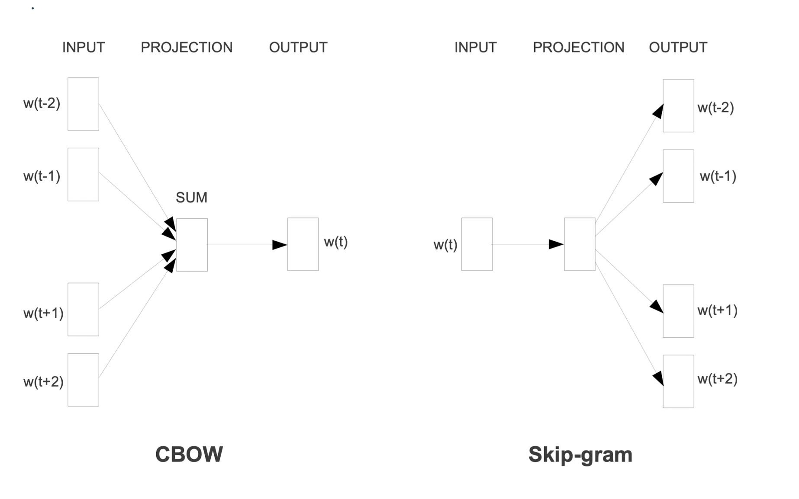

## Paper info

**Title:** [Efficient Estimation of Word Representations in Vector Space](https://arxiv.org/abs/1301.3781)

**Authors:** Tomas Mikolov, Kai Chen, Greg Corrado, Jeffrey Dean

## TL;DR

Word representations are the foundation of many modern NLP applications. The research introduces new log-linear models: skip-gram and CBOW architectures for representing hundreds of millions of words with a dimensionality of 50–100, producing word vectors that accurately capture word relations across multiple degrees of similarity. Unlike techniques previously proposed in earlier neural language models, this work shows that training can be computationally feasible.

## Context

Previous research has proposed various model architectures for learning continuous word representations. Yoshua Bengio et al. propose a feed-forward neural language model, with an input layer consisting of a concatenation of a one-hot encoding of the vocabulary, followed by a projection, and hidden and output layers. The main drawback is the output layer: for a model with context size $N = 10$, projection dimension $D$ of 500–2000, and hidden layer $H$ of 500–2000, each prediction requires computing a probability distribution over the entire vocabulary $V$.

$$
Q = N \times D + N \times D \times H + H \times V
$$

$H \times V$ is the dominant term in the architecture.

Other research proposes recurrent neural networks that overcome the fixed-context-size limitation of the feed-forward neural networks. Unlike FFNNs, RNNs eliminate the need for projecting the input using a projection layer and instead utilize sequential modeling to connect the hidden layer to itself, allowing it to simulate short-term memory.

$$
Q = H \times H + H \times V
$$

Similar to FFNN, RNNs' dominant term is $H \times V$. Although in both cases, the time complexity can be reduced to $H \times \log_2(V)$ using a hierarchical version of softmax, where the vocabulary is represented as a Huffman binary tree. The main idea is to utilize a Huffman tree to assign short binary codes to frequent words in the vocabulary. Thus, when calculating the final softmax, frequent words will require fewer softmax computations.

```
              Root
             /    \
            ●      ●
           / \    / \
        "the" "of" "dog" ●
                        / \
                   "zebra" "xylophone"
```

## Main idea

The paper introduces two main architectures: the Continuous Bag-of-Words (CBOW) model and the Continuous Skip-gram model. The training objective of CBOW is to learn to predict the current word based on the words surrounding it. In the case of Skip-gram, the objective is to learn to predict the surrounding words based on the current word.



Figure 1: CBOW predicts the current word from context; Skip-gram predicts context from the current word.

Both these models reduce the computational complexity by utilizing a hierarchical version of the softmax and make it possible to train models using large corpora with trillions of words.

$$
Q = C \times (D + D \times \log_2(V))
$$

## Conclusion

With this new approach to word representation, the authors trained models on syntactic and semantic language tasks. Their results were significantly better than other models trained on similar tasks; thus, they established the effectiveness of their approach.
